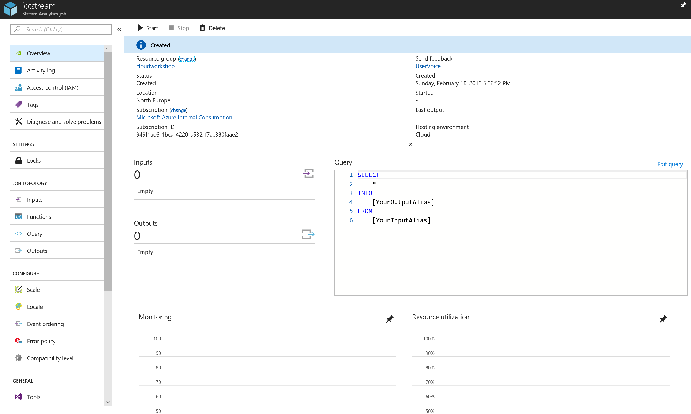
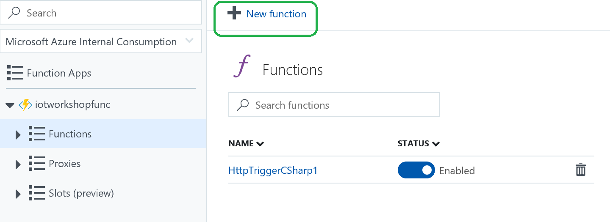

# Lab 2.1
For this lab we will use a device simulator to send "Temperature" measurements to an IoT Hub, save the messages to blob storage and report back to the device via an Azure Function if the “Temperature becomes too hot.


You can create the architecture in 2 ways:
1. By following a step-by-step guide
2. By provisioning the Azure resources through a template: 
<a href="https://portal.azure.com/#create/Microsoft.Template/uri/https%3A%2F%2Fraw.githubusercontent.com%2Fmikelindberg%2FCloud-workshops%2Fmaster%2FLab2.1%2Fprovision%2Ftemplates%2Fmaster.json" target="_blank">
    
</a>

Then continue the lab below but skip the provisioning of actual Azure resources (IoT Hub, Stream Analytics, Function, Storage).

## Step-by-step guide
Sign in to <http://portal.azure.com>

### Create Resource group
On the left pane choose Resource Groups
Click the "+ Add" button to create a new Resource group
Give the Resource group a name and choose North Europe as region


### Create IoT Hub
You might need to the refresh icon in Azure to see your new Resource group
Select your new Resource group and then click the "+ Add" button to add an IoT hub
Search for IoT Hub and then click “Create”


IoT Hub setting
Give the IoT Hub a name 
Select the F1 pricing tier
Use the Resource group you just created
Location North Europe


 
Go back to your Resource group and verify that the IoT Hub there

### Create Blob storage
Add a Storage account to your Resource group
 
Storage account settings 
* Give the Storage account a name
* Select your Resource group
* Location North Europe
* Leave everything else with default settings


### Create Stream Analytics Job

Add a Stream Analytics job to your Resource group
Stream Analytics Job setting
* Give the Stream Analytics job a name
* Use your Resource group
* Location North Europe
* Hosting environment (Cloud)
 
Go back to your Resource group and select the Stream Analytics job
Click Input to create a new input for the Stream Analytics job
 
Click the “Add Stream Input” button, select IoT Hub and setup it up to receive messages from your IoT Hub



Give the Stream Analytics job an output and select Blob storage as the output type


 
Edit the Stream Analytics Query by change the input to your IoT Hub name and the output to your Blob Storage name


 
1. Start the Stream Analytics job from the Stream Analytics Overview page
2. Go and [download the Git repo from](https://github.com/mikelindberg/Cloud-workshops)
3. Go to IoT Hub and click IoT Devices
4. On the IoT Devices page click **"Add"** and give the IoT device a name e.g. **Simulator**
5. After you created a new device click refresh on the IoT Device page until the new device appears.
6. Select the device and copy the Connection string you will need this to run the **Device Simulator** app. [Follow the Device simulator guide](https://github.com/mikelindberg/Cloud-workshops/tree/master/Device_Simulator)

### Run solution and verify data
Start the solution and verify that the simulator is sending messages to
1. IoT Hub: Look on the IoT Hub Overview page and see “Usage”
2. Stream Analytics Job: Look on the Stream Analytics Overview page and see “Monitoring” there should be events coming in
3. Under your storage account go to Blobs, select your container, drill down to the lowest level of the folder structure and verify that there is a payload
4. Stop the Stream Analytics job

### Create an Azure Function App

Go back to your Resource group and add an Azure Function App.
 
1. In the settings for the Function App select North Europe as location 
2. Create a new function (select HTTP trigger)



3. In the Function App run.csx file copy/paste the following code instead of the default code

```csharp
#r "Newtonsoft.Json"

using System;
using System.Threading.Tasks;
using Microsoft.Azure.Devices;
using Newtonsoft.Json;
using System.Net;

public static async Task<HttpResponseMessage> Run(HttpRequestMessage req, TraceWriter log)
{
  try {   
    var content = req.Content;
    string jsonContent = content.ReadAsStringAsync().Result;
    log.Info($"Payload: {jsonContent}");
    var messageItem = JsonConvert.DeserializeObject<Sensor[]>(jsonContent);

    var connectionString = "<Connection String>";
    // create IoT Hub connection.
    var serviceClient = ServiceClient.CreateFromConnectionString(connectionString, Microsoft.Azure.Devices.TransportType.Amqp);
    var methodInvocation = new CloudToDeviceMethod("Off") { ResponseTimeout = TimeSpan.FromSeconds(10) };

    log.Info($"Ready to send DM to device {messageItem[0].DeviceId}");

    //send DM
    var response = await serviceClient.InvokeDeviceMethodAsync(messageItem[0].DeviceId, methodInvocation);
}
catch(System.Exception ex) {
  log.Info(ex.Message);
  return new HttpResponseMessage(HttpStatusCode.InternalServerError);
}

return new HttpResponseMessage(HttpStatusCode.OK);
}

class Sensor
{
  public string DeviceId { get; set; }
}
```

4. The **connectionString** variable should get the value from your IoT Hub/ Shared access policies/ service / connection string primary key

5. Under your Function go to View Files and add a new file called project.json
6. Copy the content below to the project.json file

```json
{
  "frameworks": {
  "net46":{
    "dependencies": {
      "Microsoft.Azure.Devices": "1.4.1",
      "Microsoft.Azure.Amqp": "2.0.0"
      }
    }
  }
}
```

7. Restart the Function

### Update your Stream Analytics job

1. Add the new function as an Output to your Stream Analytics job


2. Update your Stream Analytics query so it is like below (define inputs and outputs with aliases you provided)

```sql
SELECT
*
INTO
    [outputblob]
FROM
    [iothubinput]

    SELECT 
    IoTHub.ConnectionDeviceId DeviceId
    INTO
    [functionOutput]
    FROM 
    [iothubinput]
    WHERE Sensor.Temperature > 30.0
```


Start the Stream Analytics job (wait with next step until it is started)
Run the Device Simulator
Verify that the “Temperature” reaches 30+ degrees, then stops for 10 seconds and then restarts at 25 degrees
