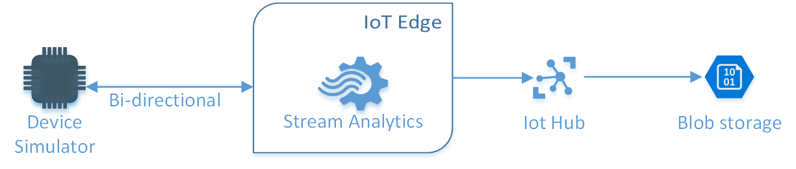
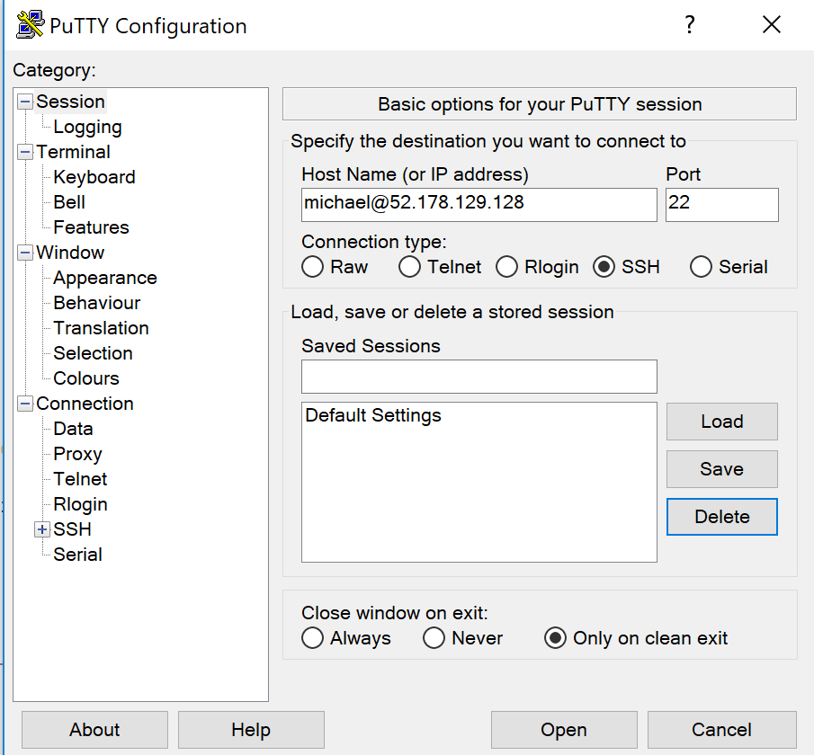
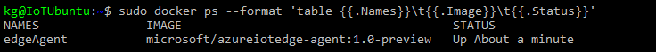
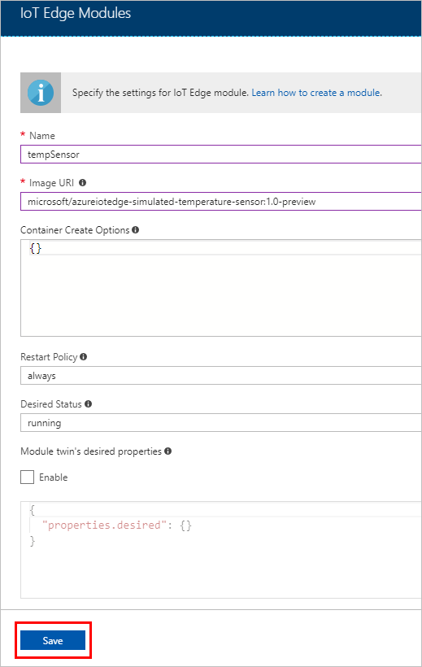
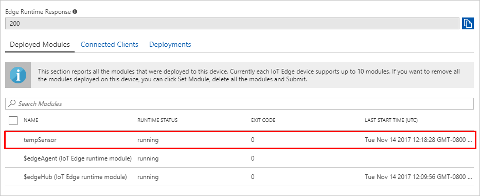
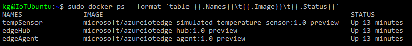
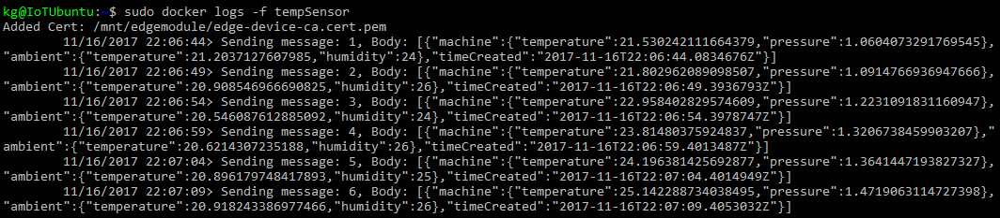

# Lab 2.2
For this lab we will implement the Azure IoT edge to our architecture and only send necessary data to Azure. In order to run Azure IoT Edge you need to run Docker and we will in this lab do that on an Ubuntu vm.

### Create Ubuntu vm
Add an **Ubuntu Server vm 16.04 LTS** to your Resource group

Ubuntu VM settings
* Give the vm a name
* Provide a user name
* Choose "Password" as the Authentication type
* Select your Resource Group
* Select North Europe as Location and click OK
* Select "B2ms" as your vm size
* On page 3 "Settings" leave everything as-is and click "OK"
* On page 4 click "Create"

### Install Putty and connect to Ubuntu vm
To connect to your new Ubuntu vm you can use Putty.

[Installation link](https://www.chiark.greenend.org.uk/~sgtatham/putty/latest.html)

Go to your Ubuntu vm under your Resource Group and click "Connect". This will give you an SSH string which you should copy paste to Putty.

### Install Docker
Log on to your new Ubuntu vm and follow the Docker installation guide.
<https://docs.docker.com/install/linux/docker-ce/ubuntu>

On your Ubuntu vm install Python with the following command.
>sudo apt-get install python-pip

### Register an IoT Edge Device
Create a device identity for your simulated device so that it can communicate with your IoT hub. Since IoT Edge devices behave and can be managed differently than typical IoT devices, you declare this to be an IoT Edge device from the beginning. 
1. In the Azure portal, navigate to your IoT hub.
2. Select IoT Edge (preview).
3. Select Add IoT Edge device.
4. Give your simulated device a unique device ID.
5. Select Save to add your device.
6. Select your new device from the list of devices. 
7. 
7. Copy the value for Connection string--primary key and save it. You'll use this value to configure the IoT Edge runtime in the next section. 

### Install and start the IoT Edge Runtime
The IoT Edge runtime is deployed on all IoT Edge devices. It comprises two modules. First, the IoT Edge agent facilitates deployment and monitoring of modules on the IoT Edge device. Second, the IoT Edge hub manages communications between modules on the IoT Edge device, and between the device and IoT Hub. 

On the machine where you'll run the IoT Edge device, download the IoT Edge control script:
> sudo pip install -U azure-iot-edge-runtime-ctl

Configure the runtime with your IoT Edge device connection string from the previous section:
> sudo iotedgectl setup --connection-string "{device connection string}" --auto-cert-gen-force-no-passwords

Start the runtime:
> sudo iotedgectl start

Check Docker to see that the IoT Edge agent is running as a module:
> sudo docker ps

### Deploy a temperature sensor module
One of the key capabilities of Azure IoT Edge is being able to deploy modules to your IoT Edge devices from the cloud. An IoT Edge module is an executable package implemented as a container. In this section, you deploy a module that generates telemetry for your simulated device. 

1. In the Azure portal, navigate to your IoT hub.
2. Go to IoT Edge (preview) and select your IoT Edge device.
3. Select Set Modules.
4. Select Add IoT Edge Module.
5. In the Name field, enter tempSensor. 
6. In the Image URI field, enter **microsoft/azureiotedge-simulated-temperature-sensor:1.0-preview**. 
7. Leave the other settings unchanged, and select Save.

8. Back in the Add modules step, select Next.
9. In the Specify routes step, select Next.
10. In the Review template step, select Submit.
11. Return to the device details page and select Refresh. You should see the new tempSensor module running along the IoT Edge runtime. 

### View generated data
In this quickstart, you created a new IoT Edge device and installed the IoT Edge runtime on it. Then, you used the Azure portal to push an IoT Edge module to run on the device without having to make changes to the device itself. In this case, the module that you pushed creates environmental data that you can use for the tutorials. 

Open the command prompt on the computer running your simulated device again. Confirm that the module deployed from the cloud is running on your IoT Edge device:

>sudo docker ps

View the messages being sent from the tempSensor module to the cloud:
> sudo docker logs -f tempSensor

### Create a Stream Analytics job
To deploy a Stream analytics job to the edge follow the this [Guide](https://docs.microsoft.com/en-us/azure/iot-edge/tutorial-deploy-stream-analytics#create-an-azure-stream-analytics-job)

